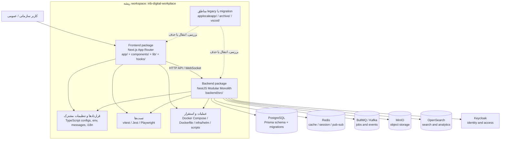
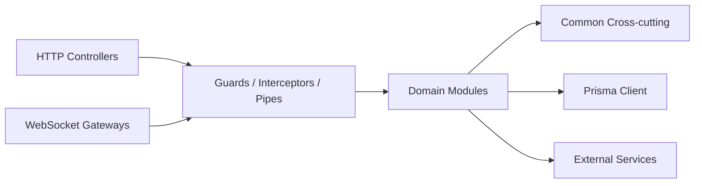
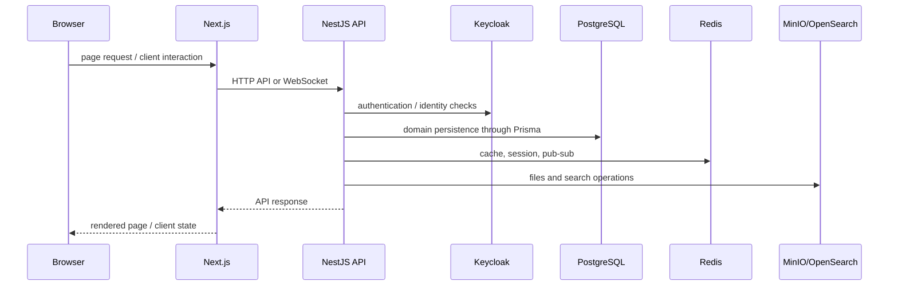

# نقشه معماری IRIB Digital Workplace

**تاریخ بررسی:** 2026-09-16  
**وضعیت:** نقشه وضع موجود (As-Is)؛ این سند پیشنهاد بازسازی کامل نیست.

## 1. نمای کلان



## 2. طبقه‌بندی پوشه‌ها

### 2.1 لایه محصول

| مسیر                           | نقش                                                                                                    | وضعیت معماری                                   |
| ------------------------------ | ------------------------------------------------------------------------------------------------------ | ---------------------------------------------- |
| `app/`                         | مسیرها و صفحات Next.js با App Router؛ شامل `(admin)`, `(authenticated)`, `(public)`, `api/`, `wizard/` | مسیر اصلی frontend                             |
| `components/`                  | کتابخانه UI و کامپوننت‌های دامنه‌ای؛ شامل atoms، molecules، organisms، ui و widgets                    | کتابخانه shared در سطح frontend                |
| `app/components/`              | کامپوننت‌های نزدیک به routeها و flowهای App Router                                                     | ناحیه محلی frontend؛ هم‌پوشان با `components/` |
| `app/hooks/` و `hooks/`        | hookهای اختصاصی routeها در کنار hookهای shared                                                         | duplicate zone محتمل                           |
| `lib/`                         | کتابخانه‌های shared در ریشه frontend                                                                   | مرجع shared پیشنهادی                           |
| `i18n/` و `messages/`          | تنظیمات بین‌المللی‌سازی و پیام‌های ترجمه                                                               | shared frontend configuration                  |
| `backend/src/`                 | API، منطق دامنه، cross-cutting concerns و WebSocket                                                    | backend اصلی                                   |
| `backend/src/devtools/wizard/` | ابزار راه‌اندازی و عیب‌یابی فقط برای توسعه؛ با `ENABLE_DEV_WIZARD` و خارج از production                | مرز development-only                           |

### 2.2 بک‌اند



`backend/src/modules/` در حال حاضر ماژول‌هایی مانند `iam`, `access-control`, `content`, `forms`, `organization`, `media`, `storage`, `notification`, `communication`, `tickets`, `search`, `health` و سایر حوزه‌های دامنه را در خود دارد. Wizard در `backend/src/devtools/wizard/` و خارج از ماژول‌های دامنه قرار دارد.

`backend/src/common/` محل concerns مشترک backend مانند cache، tracing، monitoring، queue، guard، filter، decorator و middleware است.

`backend/prisma/` شامل `schema.prisma`، seed و migrationهای دیتابیس است. این مسیر مرجع persistence backend محسوب می‌شود.

### 2.3 زیرساخت و اجرای محلی

| مسیر / فایل                            | نقش                                                                                                  |
| -------------------------------------- | ---------------------------------------------------------------------------------------------------- |
| `docker-compose.yml`                   | سرویس‌های توسعه و یکپارچه‌سازی مانند PostgreSQL، Redis، MinIO، OpenSearch، Keycloak، Kafka و Mailhog |
| `docker-compose.prod.yml`              | ترکیب سرویس‌های production                                                                           |
| `Dockerfile`                           | build و اجرای frontend ریشه‌ای                                                                       |
| `backend/Dockerfile`                   | build و اجرای backend                                                                                |
| `infra/helm/`                          | chartهای Kubernetes موجود در سطح workspace                                                           |
| `backend/infra/`                       | زیرساخت و تنظیمات نزدیک به backend                                                                   |
| `scripts/` و فایل‌های `*.bat` / `*.sh` | setup، deploy، launcher و عملیات محلی                                                                |
| `.env*`                                | پیکربندی محیطی؛ نباید به قرارداد runtime بین packageها تبدیل شود                                     |

### 2.4 تست و کیفیت

| مسیر / فایل                                      | نقش                                                   |
| ------------------------------------------------ | ----------------------------------------------------- |
| `tests/`                                         | تست‌های frontend/unit یا integration در سطح workspace |
| `e2e/`                                           | تست‌های Playwright برای flowهای کاربری                |
| `backend/**/*.spec.ts` و پیکربندی Jest backend   | تست‌های backend                                       |
| `vitest.config.ts`                               | runner اصلی frontend/unit                             |
| `playwright.config.ts`                           | runner تست‌های E2E                                    |
| `eslint.config.js`, `tsconfig.json`, `knip.json` | lint، typecheck و شناسایی کدهای بلااستفاده            |

## 3. مدل اجرایی فعلی



## 4. مرزهای معماری مهم

1. `app/` نقطه ورود UI و routeهاست؛ `components/` کتابخانه reusable frontend است.
2. `backend/src/` باید تنها محل منطق دامنه و API backend باقی بماند.
3. Prisma schema و migrationهای `backend/prisma/` مرجع داده‌اند؛ مدل‌سازی دیتابیس نباید در frontend تکرار شود.
4. ارتباط frontend با backend از مسیر API و WebSocket انجام می‌شود؛ import مستقیم از `backend/` به frontend مجاز نیست.
5. `infra/`، Docker و scriptها لایه عملیات‌اند و نباید حامل منطق دامنه باشند.

## 5. Duplicate zones و migration drift

### قطعی یا قابل مشاهده از ساختار فعلی

- **دو لایه component:** `components/` مسیر canonical shared است؛ `app/components/` فقط برای widgetهای route-local فعلی استفاده می‌شود و نباید محل componentهای shared جدید باشد.
- **دو لایه hook:** `hooks/` مسیر facade/canonical مصرف‌کننده‌هاست؛ implementationهای feature در `app/hooks/` باقی می‌مانند تا migration تدریجی انجام شود.
- **دو مرز infrastructure:** `infra/` در ریشه برای deployment و chartهای workspace-level، و `backend/infra/` برای runtime/backend-local ops (monitoring، backup، pgbouncer، security، vault). این دو مسیر باید در نقش خود ثابت بمانند و overlap در deployment app-level نداشته باشند.
- **دو package در یک workspace:** root package با نام frontend و `backend/package.json`. این ساختار monorepo کامل نیست، اما از یک پروژه تک‌پکیجی هم پیچیده‌تر است.
- **مناطق با نام legacy/migration:** `archive/`, `applocaleapp/`, `vscod/`. تا زمانی که entrypoint و مالکیت آن‌ها مشخص نشود، نباید بخشی از runtime اصلی فرض شوند.
- **ابزار توسعه:** Wizard در `backend/src/devtools/wizard/` قرار دارد و فقط وقتی `NODE_ENV` برابر production نباشد و `ENABLE_DEV_WIZARD` برابر `false` نباشد، register می‌شود.
- **مسیر Wizard توسعه:** رابط کاربری در `app/wizard/` و API ابزار در `backend/src/devtools/wizard/` قرار دارد؛ این قابلیت در production register نمی‌شود.

### مواردی که باید قبل از refactor تأیید شوند

- [x] آیا `app/components/` و `components/` واقعاً importهای مستقل و استفاده production دارند؟ بله؛ اولی route-local و دومی shared است.
- [x] آیا `hooks/` ریشه‌ای و `app/hooks/` مسئولیت‌های متفاوت دارند یا یکی باید حذف/ادغام شود؟ بله؛ root facade و app implementation هستند.
- آیا `archive/`, `applocaleapp/` و `vscod/` برای rollback نگهداری می‌شوند یا دیگر مصرف runtime ندارند؟
- [x] آیا `backend/infra/` و `infra/helm/` یک pipeline استقرار مشترک دارند یا دو مسیر مستقل‌اند؟ بله؛ `infra/helm/` برای deployment عمومی workspace و `backend/infra/` برای پشتیبان‌گیری، monitoring، pgbouncer و امنیت/backend-local runtime است؛ overlap در app release وجود ندارد.
- [x] آیا هشدار Prisma `relationMode = "prisma"` نیاز به index حدسی دارد؟ خیر؛ این هشدار عمومی است و در schema فعلی شاخص‌های اصلی برای `OutboxEvent` و `SmsMessage` وجود دارد. افزودن index بدون شواهد hot-path، risk و migration نامشخص ایجاد می‌کند.

## 6. پیشنهاد target structure با کمترین جابه‌جایی

```text
irib-digital-workplace/
├── app/                    # فقط routeها، layouts و route-local code
├── components/             # تنها UI shared frontend
├── hooks/                  # تنها hooks shared frontend
├── lib/                    # تنها utilities و clients shared frontend
├── backend/                # package مستقل NestJS + Prisma
├── contracts/              # فقط در صورت نیاز واقعی به DTO/schema مشترک
├── tests/                  # unit/integration frontend یا cross-package
├── e2e/                    # Playwright
├── infra/                  # مالک واحد deployment و runtime infrastructure
├── docs/                   # مستندات جاری
└── archive/                # فقط artefactهای غیرruntime با README و تاریخ خروج
```

### ترتیب پیشنهادی پاک‌سازی

1. inventory کردن importها و entrypointهای هر duplicate zone؛ بدون جابه‌جایی فوری.
2. تعیین مالکیت: shared، route-local، backend-only یا archive.
3. انتقال تدریجی importها به مسیر canonical و افزودن alias/قاعده lint در صورت نیاز.
4. حذف یا archive کردن مسیرهای بدون مصرف پس از یک build، typecheck و تست E2E موفق.
5. به‌روزرسانی README و مستندات deployment بعد از تثبیت مسیرها.

## 7. جمع‌بندی

معماری فعلی از نظر قابلیت‌ها یک **Next.js frontend + NestJS modular monolith + سرویس‌های زیرساختی Dockerized** است. مشکل اصلی شکست فنی یک subsystem نیست؛ مسئله اصلی، ابهام در مالکیت مسیرهای مشترک و باقی‌ماندن آثار migration در کنار ساختار جاری است. بنابراین refactor باید ابتدا با inventory و canonical pathها شروع شود، نه با جابه‌جایی گسترده فایل‌ها.
